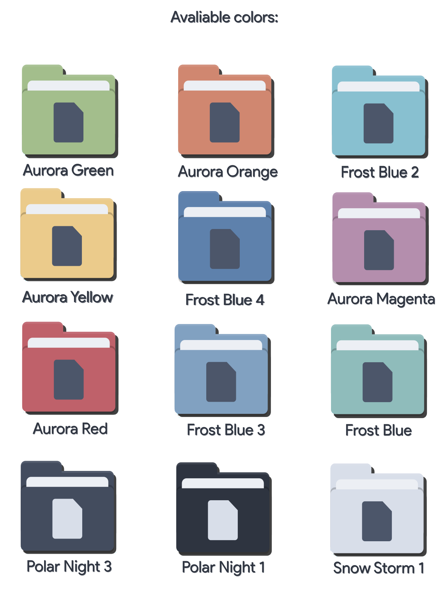

 Papirus Nord
=====

"Charming your distro!"

Custom colors for folder icons for <a href="https://github.com/PapirusDevelopmentTeam/papirus-icon-theme">Papirus Icon Theme</a>!

This icons come from the Nord pallete made by <a href="https://github.com/arcticicestudio/nord">Arctic Ice Studio</a>!

  

## Requeriments

 - <a href="https://github.com/PapirusDevelopmentTeam/papirus-icon-theme">Papirus Icon Theme</a>
 - <a href="https://github.com/PapirusDevelopmentTeam/papirus-folders">Papirus Folders Script</a>

## Instalation
 - Install de patch program(package name: patch)
 - Run the Install.sh with root, for change or install the Papirus-folders script!
 - Enjoy this icons!

These icons were created and named for a Java program, <a href="https://github.com/Joshaby/Papirus-Folder-Icon-Creator">Papirus Folder Icon Creator</a> created by me, an easy way to make icons from Papirus folders!

## License

GNU GPL v2